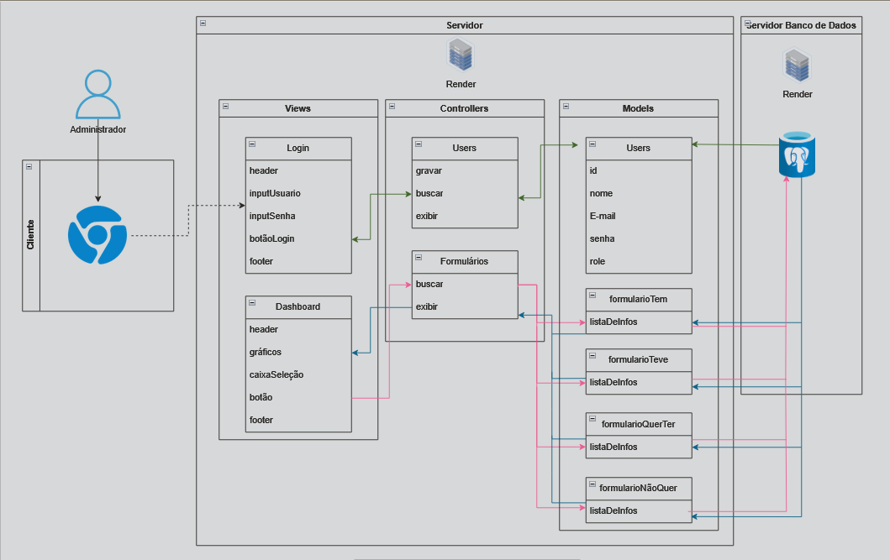
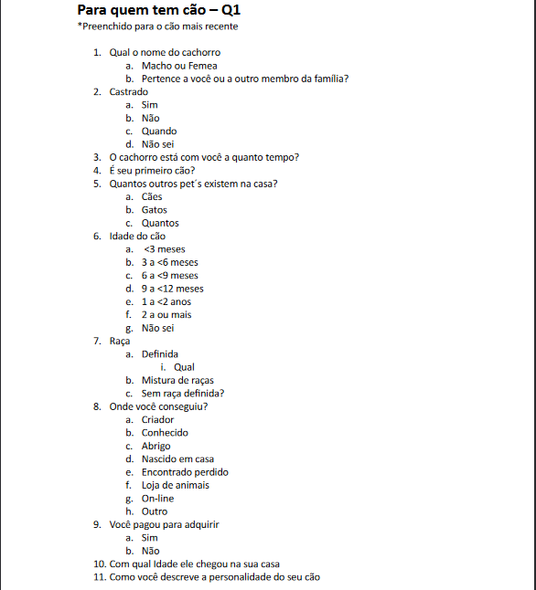
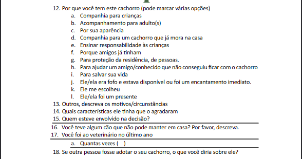
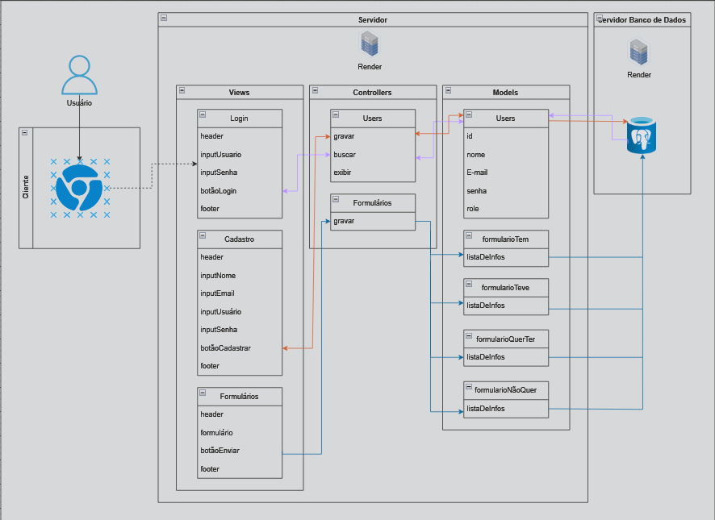

# Arquitetura MVC

Ponderada de Programação da Semana 1

## 1. Descrição do Projeto

- **Nome do Projeto:** Abandono Zero (PsicoPets)
- **Descrição:** O projeto tem como objetivo desenvolver uma aplicação web que correlaciona dados sobre comportamentos humanos e as relações destes com a compra, adoção, preterimento de adquirir ou até o desinteresse no adquirimento de cachorros através de formulários e armazenar essas respostas em um banco de dados, de forma que esses dados possam ser acessados e disponibilizados para downloads, sendo que apenas o administrador tenha acesso a essas informações.
- **Arquitetura:** MVC (Model-View-Controller)
- **Ferramenta de Diagramação:** A ferramenta de diagramação utilizada foi o draw.io
 

## 2. Introdução

&nbsp;&nbsp;&nbsp;&nbsp;A origem da arquitetura MVC remonta à década de 1970, quando foi introduzida no contexto do desenvolvimento de interfaces gráficas de usuário no Xerox PARC (Palo Alto Research Center), um centro de pesquisa da Xerox Corporation. Inventada pelo cientista da computação norueguês Trygve Reenskaug, o objetivo inicial era separar a lógica de apresentação da aplicação da lógica de negócios, tornando o código mais modular e mais fácil de manter.

&nbsp;&nbsp;&nbsp;&nbsp;A arquitetura MVC (Model-View-Controller) é um padrão de arquitetura de software que organiza uma aplicação em três componentes principais: Modelo, Visão e Controlador. Cada um desses componentes desempenha um papel específico na aplicação, permitindo uma separação clara de preocupações e facilitando o desenvolvimento e a manutenção do código.

- **_Modelo (Model):_** O Modelo representa os dados e a lógica de negócios da aplicação. Ele é responsável por gerenciar o estado dos dados, responder a consultas sobre esses dados e processar as atualizações dos mesmos. O Modelo é independente da Visão e do Controlador, o que significa que ele pode ser reutilizado em diferentes contextos sem alterações.

- **_Visão (View):_** A Visão é responsável por apresentar a interface gráfica ao usuário. Ela exibe os dados do Modelo ao usuário e encaminha as interações do usuário para o Controlador. A Visão é passiva e não contém lógica de negócios; ela apenas exibe as informações fornecidas pelo Modelo.

- **_Controlador (Controller):_** O Controlador atua como intermediário entre o Modelo e a Visão. Ele interpreta as entradas do usuário, manipula as operações do Modelo e atualiza a Visão de acordo com as mudanças no Modelo. O Controlador contém a lógica de aplicação e coordena as interações entre o Modelo e a Visão.

&nbsp;&nbsp;&nbsp;&nbsp;A arquitetura MVC promove a separação de preocupações ao dividir uma aplicação em três componentes distintos, cada um responsável por uma área específica da aplicação. Isso torna o código mais modular, facilitando a manutenção e o teste da aplicação. Além disso, a arquitetura MVC é altamente escalável, permitindo que novos recursos sejam adicionados à aplicação sem afetar os componentes existentes. [1]
 

## 3. Arquitetura do Projeto

&nbsp;&nbsp;&nbsp;&nbsp;Para facilitar o entendimento da aplicação essa arquitetura foi dividida em duas partes: do administrador, que terá acesso aos gráficos e dados, e o usuário, que irá responder um dos quatro formulários.

Figura 1 - Arquitetura MVC: Admin

Fonte: Material produzido pelo autor (2024).

&nbsp;&nbsp;&nbsp;&nbsp;A primeira arquitetura (figura 1) representa o acesso à plataforma e acesso aos gráficos, possuindo alguns elementos:

### Modelos (Models):

&nbsp;&nbsp;&nbsp;&nbsp;Em modelos foram estabelecidas cinco, a view de user que tem como elementos:

- ***id:*** o número de identificação associado ao conjunto de dados;
- ***nome:*** nome atrelado aos dados de login;
- ***e-mail:*** e-mail do admin;
- ***senha:*** senha do admin;
- ***role:*** o papel/acessos atribuídos aos usuários. 

Já o segundo deles, o formulárioTem, será o modelo de perguntas baseado em usuários que já possuem cachorro(s):
- ***listaDeInfos:*** todas as perguntas foram resumidas apenas por uma propriedade aqui na arquitetura por conta de questões de ilegibilidade pois a letra ficaria pequena, segue o documento que constam todas os dados a serem coletados:

Figura 3 - Página com perguntas do formulárioTem (parte 1)

Fonte: Material disponibilizado pelo stakeholder (2024).

Figura 4 - Página com perguntas do formulárioTem (parte 2)

Fonte: Material disponibilizado pelo stakeholder (2024).

O terceiro deles, o formulárioTeve, será o modelo de perguntas baseado em usuários que já possuíram cachorro(s):
- ***listaDeInfos:*** todas as perguntas foram resumidas apenas por uma propriedade aqui na arquitetura por conta de questões de ilegibilidade pois a letra ficaria pequena, ainda não há documentos disponibilizados que constam os exatos dados que precisam ser coletados com esse formulário.

O quarto, o formulárioQuerTer, será o modelo de perguntas baseado em usuários que estão pensando em adquirir cachorros, seja por meio da adoção ou da compra:
- ***listaDeInfos:*** todas as perguntas foram resumidas apenas por uma propriedade aqui na arquitetura por conta de questões de ilegibilidade pois a letra ficaria pequena, ainda não há documentos disponibilizados que constam os exatos dados que precisam ser coletados com esse formulário.

O último, o formulárioNãoQuer, será o modelo de perguntas baseado em usuários que não cogitam ter um cachorro e nem tiveram um:
- ***listaDeInfos:*** todas as perguntas foram resumidas apenas por uma propriedade aqui na arquitetura por conta de questões de ilegibilidade pois a letra ficaria pequena, ainda não há documentos disponibilizados que constam os exatos dados que precisam ser coletados com esse formulário.

### Controladores (Controllers):

&nbsp;&nbsp;&nbsp;&nbsp;Os controladores serão responsáveis por intermediar os processos entre o view e o model. Há dois métodos, sendo o primeiro o users:

- **gravar:** grava os dados de um usuário no banco de dados. como o INSPA irá intermediar essa parte do acesso admin, ainda não foi delimitado alguma maneira de cadastrar um admin diretamente pela aplicação;
- **buscar:** busca um usuário no banco de dados;
- **exibir:** irá direcionar para outra página caso os dados sejam validados, que será, nesse caso, o página de dashboard.

Já o segundo é o formulários: 
- **buscar:** busca um dos 4 formulários no banco de dados;
- **exibir:** irá direcionar para os gráficos específicos de acordo com os dados requisitados já na página do dashboard.

### Views (Views):

&nbsp;&nbsp;&nbsp;&nbsp;Nas views há dois elementos, sendo o primeiro deles o login, responsável por coletar dados específicos e mandar para a validação e, eventualmente, a interface com os dados:
- ***header:*** elemento visual (no wireframe do projeto, a navbar com os acessos às outras partes do site estará dentro da header)
- ***inputUsuário:*** nome do usuário;
- ***inputSenha:*** senha;
- ***botãoLogin:*** botão que inicia a requisição;
- ***footer:***  rodapé com informações adicionais, como informações de contato, links de política de privacidade ou direitos autorais.

Já o segundo é o dashboard que exibirá os gráficos e dados requisitados, que tem as seguintes propriedades:
- ***header:*** elemento visual (no wireframe do projeto, a navbar com os acessos às outras partes do site estará dentro da header)
- ***gráficos:*** gráficos plotados de acordo com a seleção dos filtros;
- ***caixaSeleção:*** caixa de selecão que faz a filtragem dos dados;
- ***botão:*** botão que inicia a requisição;
- ***footer:***  rodapé com informações adicionais, como informações de contato, links de política de privacidade ou direitos autorais.

### Fluxo de Operações

&nbsp;&nbsp;&nbsp;&nbsp;Seguindo essa arquitetura o fluxo de operações segue a seguinte linha de execução:

***linhas verdes escuras:***
1. O administrador acessa a página de login e se depara com a view Login.
2. O administrador preenche suas informações de acesso e clica no botao para validação.
3. Ao controlador aciona o método buscar em "users".
4. O controlador users usa o modelo de mesmo nome para verificar as informações no banco de dados.
5. Se as credenciais estiverem corretas, o controlador invoca utiliza a propriedade "exibir" para carregar a interface do dashboard.
6. A view do dashboard é apresentada ao administrador, possivelmente com informações personalizadas obtidas através do modelo usuarios.
 

***linhas rosas:***
1. Através das caixas de seleção e do botão do dashboard, uma requisição é aberta para filtrar as informações dos 4 formulários.
2. O botão aciona o método buscar do controlador formulários.
3. O controlador formulários utiliza dos modelos de cada formulário para puxar informações do banco de dados.
 

***linhas azuis:***
1. Assim, as informações coletadas no banco de dados são retornadas para a parte dos gráficos do dashboard, passando por cada um dos componentes.

  

Figura 5 - Arquitetura MVC: Usuário

Fonte: Material produzido pelo autor (2024).

&nbsp;&nbsp;&nbsp;&nbsp;Essa segunda arquitetura (figura 5) representa a parte do usuário e possui como elementos:

### Modelos (Models):

&nbsp;&nbsp;&nbsp;&nbsp;Em modelos foram estabelecidas cinco, a view de user que tem como elementos:

- ***id:*** o número de identificação associado ao conjunto de dados;
- ***nome:*** nome atrelado aos dados de login;
- ***e-mail:*** e-mail do usuário;
- ***senha:*** senha do usuário;
- ***role:*** o papel/acessos atribuídos aos usuários. 

Já o segundo deles, o formulárioTem, será o modelo de perguntas baseado em usuários que já possuem cachorro(s):
- ***listaDeInfos:*** todas as perguntas foram resumidas apenas por uma propriedade aqui na arquitetura por conta de questões de ilegibilidade pois a letra ficaria pequena, o documento com as perguntas equivalentes é o mesmo já apresentado nas figuras 3 e 4.

O terceiro deles, o formulárioTeve, será o modelo de perguntas baseado em usuários que já possuíram cachorro(s):
- ***listaDeInfos:*** todas as perguntas foram resumidas apenas por uma propriedade aqui na arquitetura por conta de questões de ilegibilidade pois a letra ficaria pequena, ainda não há documentos disponibilizados que constam os exatos dados que precisam ser coletados com esse formulário.

O quarto, o formulárioQuerTer, será o modelo de perguntas baseado em usuários que estão pensando em adquirir cachorros, seja por meio da adoção ou da compra:
- ***listaDeInfos:*** todas as perguntas foram resumidas apenas por uma propriedade aqui na arquitetura por conta de questões de ilegibilidade pois a letra ficaria pequena, ainda não há documentos disponibilizados que constam os exatos dados que precisam ser coletados com esse formulário.

O último, o formulárioNãoQuer, será o modelo de perguntas baseado em usuários que não cogitam ter um cachorro e nem tiveram um:
- ***listaDeInfos:*** todas as perguntas foram resumidas apenas por uma propriedade aqui na arquitetura por conta de questões de ilegibilidade pois a letra ficaria pequena, ainda não há documentos disponibilizados que constam os exatos dados que precisam ser coletados com esse formulário.

### Controladores (Controllers):

&nbsp;&nbsp;&nbsp;&nbsp;Os controladores serão responsáveis por intermediar os processos entre o view e o model. Há dois métodos, sendo o primeiro o users:

- **gravar:** grava os dados de um usuário no banco de dados;
- **buscar:** busca um usuário no banco de dados;
- **exibir:** irá direcionar para outra página caso os dados sejam validados, que será, nesse caso, o página com os formulários.

Já o segundo é o formulários: 
- **gravar:** grava os dados do formulário respondido no banco de dados.

### Views (Views):

&nbsp;&nbsp;&nbsp;&nbsp;Nas views há três elementos, sendo o primeiro deles o login, responsável por coletar dados específicos e mandar para a validação e, eventualmente, a interface com os dados:
- ***header:*** elemento visual (no wireframe do projeto, a navbar com os acessos às outras partes do site estará dentro da header)
- ***inputUsuário:*** nome do usuário;
- ***inputSenha:*** senha;
- ***botãoLogin:*** botão que inicia a requisição;
- ***footer:***  rodapé com informações adicionais, como informações de contato, links de política de privacidade ou direitos autorais.

Já o segundo consiste no cadastro:
&nbsp;&nbsp;&nbsp;&nbsp;Nas views há dois elementos, sendo o primeiro deles o login, responsável por coletar dados específicos e mandar para a validação e, eventualmente, a interface com os dados:
- ***header:*** elemento visual (no wireframe do projeto, a navbar com os acessos às outras partes do site estará dentro da header)
- ***inputNome:*** nome associado ao conjunto de dados do usuário;
- ***inputEmail:*** e-mail do usuário;
- ***inputUsuário:*** nome do usuário;
- ***inputSenha:*** senha;
- ***botãoCadastrar:*** botão que inicia a requisição;
- ***footer:***  rodapé com informações adicionais, como informações de contato, links de política de privacidade ou direitos autorais.

&nbsp;&nbsp;&nbsp;&nbsp;Por fim, há o de formulários:
- ***header:*** elemento visual (no wireframe do projeto, a navbar com os acessos às outras partes do site estará dentro da header)
- ***formulário:*** estrutura de formulários;
- ***botãoEnviar:*** botão que inicia a requisição de registro de respostas no banco de dados;
- ***footer:***  rodapé com informações adicionais, como informações de contato, links de política de privacidade ou direitos autorais.

### Fluxo de Operações

&nbsp;&nbsp;&nbsp;&nbsp;Seguindo essa arquitetura o fluxo de operações segue a seguinte linha de execução:

***linhas de cor lilás:***
1. O usuário acessa a página de login e se depara com a view Login.
2. O usuário preenche suas credenciais no login e clica no botãoLogin para submeter o login.
3. A submissão do login aciona o método buscar no controlador users.
4. O controlador users utiliza o modelo de mesmo nome para verificar as informações do usuário no banco de dados.
5. Se as credenciais estiverem corretas, o controlador invoca o método exibir para carregar a página com formulários.
6. A view dos formulários é apresentada ao usuário.
 

***linhas de cor laranja:***
1. O usuário acessa a página de cadastro e se depara com a view Cadastro.
2. O usuário preenche suas informações e clica no botãoCadastrar para submeter o cadastro.
3. A submissão do cadastro aciona o método gravar no controlador users.
4. O controlador users utiliza o modelo de mesmo nome para gravar as informações do novo usuário no banco de dados.
5. A view dos formulários é apresentada ao usuário recém-cadastrado.
 

***linhas de cor azul:***
1. Na view Formulários, o usuário preenche o questionário que mais se encaixa no seu contexto e aperta o botãoEnviar para iniciar o registro de suas respostas.
2. A submissão do formulário aciona o método gravar no controlador formulários.
3. O controlador formulários utiliza o modelo de mesmo nome para gravar as informações no banco de dados.
 

### Infraestrutura:

&nbsp;&nbsp;&nbsp;&nbsp;Considerando todas as informações apresentadas anteriormente, a arquitetura MVC será implementada através do Sails.js, um framework que proverá uma organização de estruturas para o desenvolvimento dessa aplicação. Além disso, outras ferramentas utilizadas serão:

**Sails.js**

&nbsp;&nbsp;&nbsp;&nbsp;O Sails.js é um framework MVC para Node.js que facilita a criação de aplicações web e APIs, seguindo o padrão MVC. Ele oferece várias opções de configuração de rotas e suporta diversos bancos de dados, incluindo o PostgreSQL. Esse framework foi escolhido para acelerar o desenvolvimento do projeto, aproveitando sua arquitetura que promove a manutenção e a escalabilidade.
 
**Banco de Dados PostgreSQL**

&nbsp;&nbsp;&nbsp;&nbsp;O PostgreSQL é um sistema de gerenciamento de banco de dados relacional conhecido por sua robustez e confiabilidade. Ele pode ser facilmente integrado com o framework Sails.js, o que simplifica o desenvolvimento da aplicação.
 
**Render**

&nbsp;&nbsp;&nbsp;&nbsp;O Render é um serviço de hospedagem de aplicações web que suporta a criação de aplicações web e APIs. Será utilizado para hospedar a aplicação em Sails.js e o banco de dados PostgreSQL, permitindo que eles sejam escalados conforme a demanda. Além disso, facilitará o processo de monitoramento da aplicação.
 
**API dos Correios**

&nbsp;&nbsp;&nbsp;&nbsp;A API dos Correios é uma ferramenta que possibilita a consulta de CEPs e endereços, sendo empregada para assegurar a uniformidade das respostas nos formulários, evitando assim a corrupção dos dados.
 

#### Justifique as escolhas feitas e como elas impactam o projeto.

&nbsp;&nbsp;&nbsp;&nbsp;Optar pelo Sails.js como estrutura de desenvolvimento agiliza o processo de construção da aplicação, garantindo uma organização mais eficiente. A integração do Sails.js com o PostgreSQL e o Render estabelece uma base robusta para a escalabilidade e segurança da aplicação. Adicionalmente, a utilização da API dos Correios eleva a qualidade dos dados e a experiência do usuário final, complementando toda essa infraestrutura.
 

#### Implicações da Arquitetura:

&nbsp;&nbsp;&nbsp;&nbsp;A arquitetura foi utilizada levando alguns aspectos em consideração:

- ***Escalabilidade:*** A combinação da arquitetura MVC com o Sails.js e o Render permite uma expansão eficiente, garantindo que a aplicação possa lidar com um aumento de usuários e dados sem comprometer o desempenho.
 
- ***Facilidade de Manutenção:*** O uso do Sails.js, com sua estrutura baseada em MVC, simplifica a manutenção e as atualizações da aplicação. Alterações em uma parte do sistema (Model, View ou Controller) podem ser feitas com impacto mínimo nas outras partes, reduzindo a possibilidade de falhas.
 
- ***Testabilidade Aprimorada:*** Com suporte para testes de unidade e integração, o Sails.js simplifica os testes automatizados, permitindo que sejam executados com mais frequência e facilidade.
 
- ***Segurança Reforçada:*** A estrutura MVC do Sails.js contribui para a segurança da aplicação, protegendo-a contra vulnerabilidades comuns. Ao encapsular as operações de banco de dados e separar a lógica de aplicação da apresentação do usuário, ajuda a prevenir ataques. Além disso, o PostgreSQL oferece recursos de segurança essenciais para proteger dados sensíveis.
 
- ***Melhoria na Qualidade dos Dados:*** A integração com a API dos Correios para validação de dados de endereço eleva a qualidade dos dados coletados, evitando inconsistências e divergências.
 

## Referências

[1] Introdução ao Padrão MVC: Primeiros passos na Arquitetura MVC. Disponível em: <https://www.devmedia.com.br/introducao-ao-padrao-mvc/29308>.

### Recursos Adicionais:

Documentação do Sails.js: https://github.com/balderdashy/sails
Tutorial do draw.io: https://m.youtube.com/watch?v=w3zm-wbmlpc
Exemplos de diagramas MVC: https://www.lucidchart.com/pages/templates
